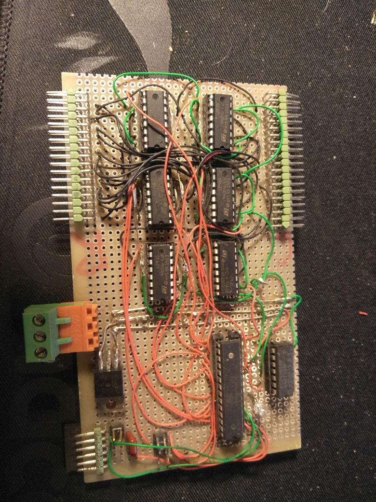
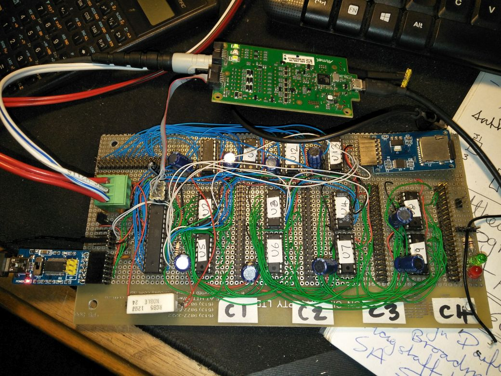

# Big Flipper: Reviving a 30 year old highway Flipdot Sign.

## Introduction
The files here document (sort-of) my last attempt at getting this project done, about 7 years ago. I hand-wired a driver board for 4 characters but I never 
had a real schematic. I worked directly with a netlist file that was processed by a Python script to generate a list of connections between components. 
This may seem an odd way of working but one of my special powers is that I can visualise a netlist easily, and it is much quicker to work with a short text
file than a large propriatary schematic.

## History
I had the idea to use a very common motor driver IC to drive my panels, the L293D, mainly since I had a couple of sticks of them left over from an old 
project, and that they are very cheaply available on Ebay. I really wanted to use a very handy driver the Allegro U2981, which is an 8 channel 1A sink driver with a serial input, easily drivable with SPI. But they are no longer made, and command huge prices on Ebay as scare spare parts. 

I originally built a single character driver, shown here . This was built so long ago 
that I used a bare ATMEGA328P AVR in DIP package, and not a Chinese Arduino Pro Mini knockoff. I probably have the schematic and code somewhere, but there is
no need to use them. This worked well enough that I built a new 4 character version, that never worked, due to a combination of wiring errors and poor
design, such as a total lack of decoupling caps, which is suicide for something switching an amp through heavily inductive loads.

Anyway on to the new 4 character version, shown here (after I had somewhat modified it, and replaced the fried drivers): . The design is captured in the netlist file [flw.txt](flw.txt), together with the scripts to work with it, which I
named `tsilten` ('netlist' backwards), found [here](../tsilten).

##
